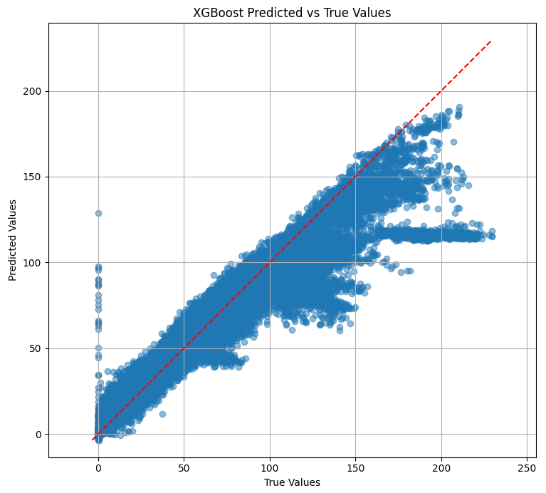
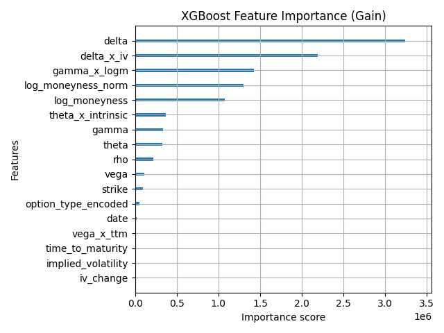
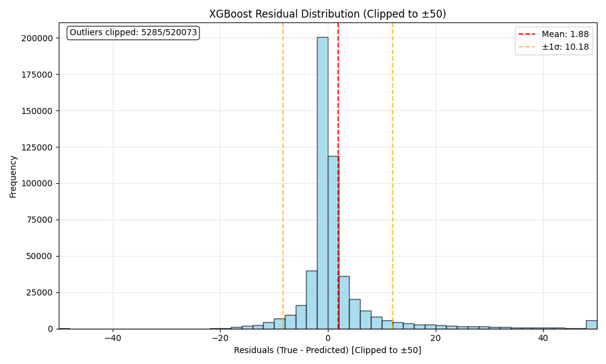
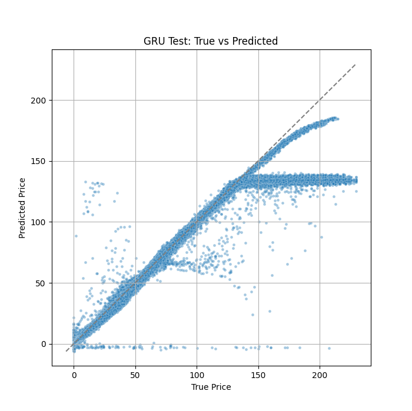
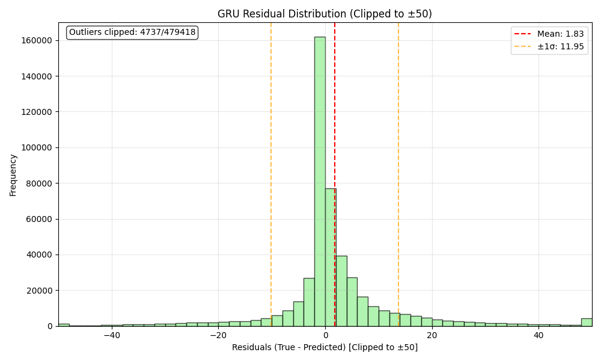
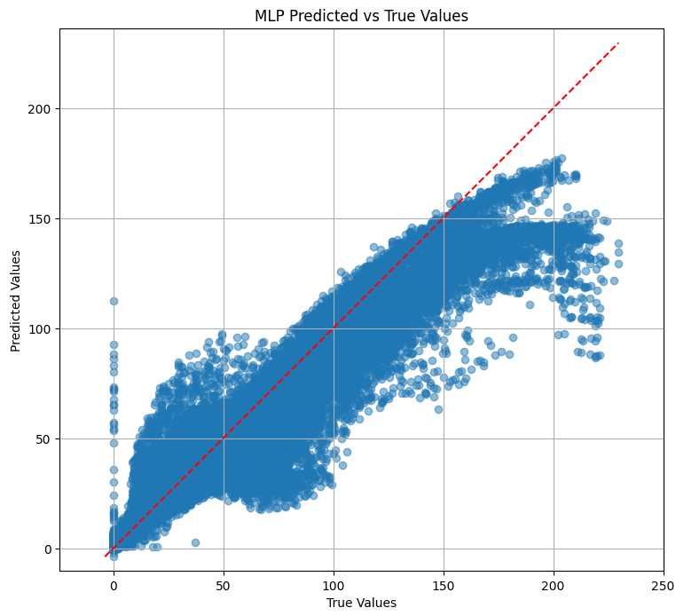
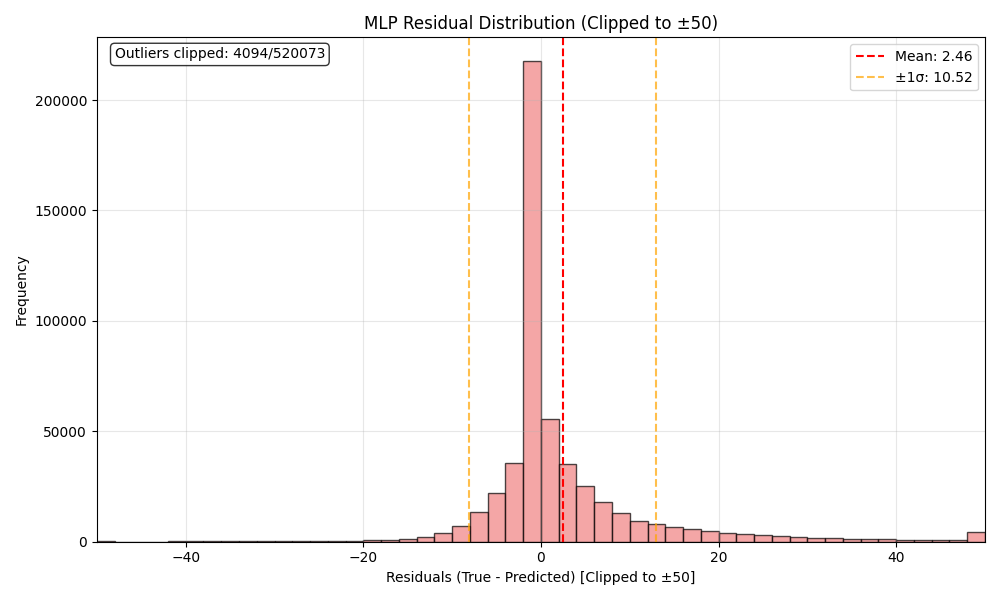
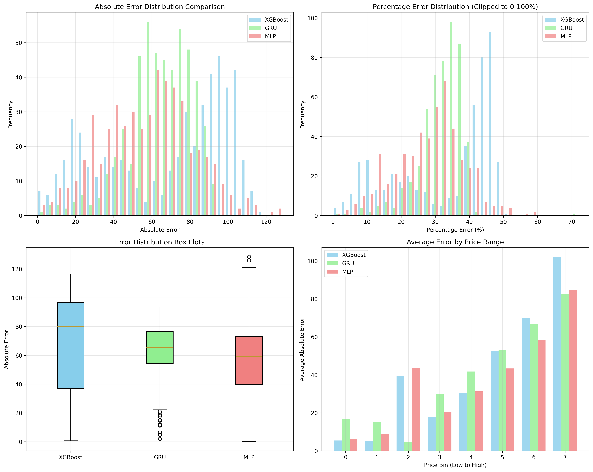
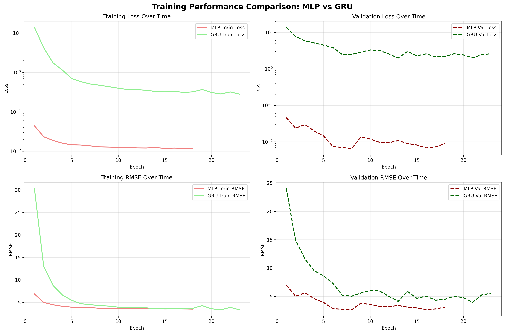
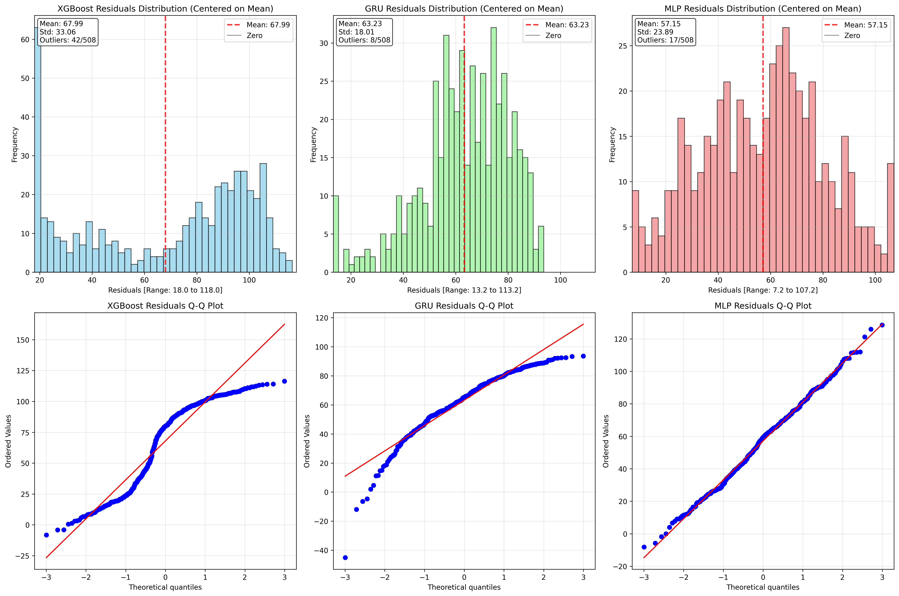

# Deep Learning for US Options Pricing ($AAPL Equity Options)

<p align="center">
  
</p>

## Summary

This project explores machine learning models for options price prediction. We compare XGBoost (gradient boosting), a Multilayer Perceptron (MLP), and a Gated Recurrent Unit (GRU) with time series windowing on historical $AAPL options data. The MLP achieved the lowest overall test error (28.03% average), demonstrating superior generalization across price ranges and smoother prediction surfaces.

However, significant data imbalance affects all models: while the GRU shows competitive performance on abundant mid-range contracts ($50-$150), it exhibits systematic prediction plateaus around $144-145 for high-value options above $180, highlighting the challenges of financial ML with heteroscedastic data. XGBoost provides reliable baseline performance but struggles with extreme values.

Results emphasize that model selection should consider both data distribution characteristics and architectural advantages, with simpler models potentially outperforming complex architectures when properly engineered for the underlying data structure.

## Table of Contents
1. [Summary](#summary)
2. [Project Description](#project-description)
3. [Motivation & Background](#motivation--background)
4. [Data Description](#data-description)
    - [Feature Engineering](#feature-engineering)
5. [Repository Structure](#repository-structure)
6. [Modeling Approach](#modeling-approach)
    - [Baseline](#baseline)
    - [Advanced](#advanced)
    - [Tuning and Feature Scaling](#tuning-and-feature-scaling)
7. [Evaluation & Results](#evaluation--results)
    - [Models Compared](#models-compared)
    - [Performance Highlights](#performance-highlights)
    - [Key Plots](#key-plots)
    - [Analysis](#analysis)
    - [Comparison Plots](#comparison-plots)
    - [Overall Performance Evaluation](#overall-performance-evaluation)
8. [Limitations & Future Work](#limitations--future-work)
    - [Limitations](#limitations)
    - [Next Steps](#next-steps)
9. [How to Run](#how-to-run)
10. [References](#references)
11. [License](#license)

## Project Description

Inspired by techniques from recent academic literature and proprietary research, This repository explores, implements, and evaluates different Machine Learning models to empirically price American equity Options for the $AAPL stock. Comparisons are made between different Machine Learning models, namely:

1. XGBoost (Gradient-Boosted Trees) with Bayesian Hyperparameter Tuning
2. Gated Recurrent Unit (GRU) with Bayesian Hyperparameter Tuning
3. Multilayer Perceptron (MLP)

## Motivation & Background
Market prices for options often deviate from theoretical values (determined by Black-Scholes, etc.) due to liquidity and market regime shifts.

We know that Machine Learning models can fit complex, nonlinear relationships between variables, and exploit additional features that are not necessarily captured by other methods of estimation.

This repo is based on recent research (See [[1]][ref1], [[2]][ref2]) and looks to bridge the gap between quant finance and modern ML.

## Data Description
For this project, I sourced recent historical options data from [Alpha Vantage](https://www.alphavantage.co/)'s Options Data API, with columns for expiration, strike, greeks, as well as integrating daily OHLC to try to capture market regime behaviour.

For this, I implemented a modular automated data ingestion pipeline using AWS S3 and Github Actions for scalability and continuous integration during development.

In training, a contract-based train/val/test split was used to avoid leakage; ensuring no contract appears in multiple splits while maintaining chronological ordering - with certain features (such as greeks, IV) being shifted one day to prevent data leakage.

Time Series Windowing was also used for the GRU to leverage its advantage in temporal modeling, creating rolling windows within each contract while ensuring **contract-level non-intersection** across train/validation/test splits.

### Feature Engineering
Here is the breakdown of features used in model training:
#### Features Used
1. 'strike'
2. 'option_type_encoded'
3. 'date'
4. 'implied_volatility'
5. 'iv_change'
6. 'delta'
7. 'gamma'
8. 'theta'
9. 'vega'
10. 'rho'
11. 'time_to_maturity'
12. 'log_moneyness_norm'

#### Greek product Features
I also feature-engineered several 'compound' features, calculated as simple products of greeks, namely:
1. 'vega_x_ttm',
2. 'gamma_x_logm',
3. 'theta_x_intrinsic',

## Repository Structure

``` 
├── .github             # GitHub Actions/workflows for CI/CD automation
│   └── workflows       # CI/CD pipeline YAMLs
├── assets              # Static assets (eval/metric graphs)
├── data                # Local data directory for final model inputs/outputs
│   └── mlp                 # Data specifically used for MLP model training
├── dataIngest          # Automated data ingestion pipeline
│   ├── config              # Config files (API keys, settings, parameters)
│   ├── helpers             # Utility functions (file handling, S3, etc.)
│   ├── logs                # Runtime logs for ingestion jobs
│   ├── scheduler           # Scheduler scripts for timed ingestion
│   ├── scripts             # One-off or batch ingestion scripts
│   └── src                 # Core pipeline modules for ingestion logic
├── logs                # General logs for model training, debugging, etc.
├── scripts             # Executable scripts for training, evaluation, or batch jobs
├── src                 # Main source code for modeling pipeline
│   ├── datasets            # Dataset loaders and preprocessing
│   ├── evaluation          # Model evaluation, metrics, and visualization tools
│   ├── features            # Feature engineering, technical indicators, etc.
│   ├── models              # Model definitions and configuration: GRU, XGBoost, MLP, etc.
│   ├── model_files         # Serialized models, configs, and artifacts
│   └── training            # Training loops and files (XGB, GRU, MLP)
```

## Modeling Approach
Models were trained on-device with identical training conditions.
### Baseline
XGBoost regression was used for speed and feature importance as a baseline to compare the other models' performance.

### Advanced
Gated Recurrent Unit (GRU) neural networks with attention for sequence modeling, implementing with and without weighted loss functions to target fat tails and rare, high-value contracts. Multilayer Perceptron with 3 hidden layers, batch normalization, dropout, and L2 regularization (weight_decay).

### MLP Configuration
<p align="center">
  
</p>

### Tuning and Feature Scaling
Optuna was used for GRU hyperparameter tuning. Feature was scaling handled using numpy and pandas. The MLP used an Adam optimizer.

## Evaluation & Results

### Models Compared
- **XGBoost** Regressor as a **Baseline**
    - Optuna Hyperparam. Tuning, 20 trials
    - MSE Loss
    - Histogram tree method
- **GRU (Gated Recurrent Unit)** neural network with attention
    - 30 epochs, early stopping
    - patience = 10
    - Huber Loss
- **MLP (Multilayer Perceptron)**
    - 100 epochs, early stopping
    - patience = 10
    - MSE Loss
- all trained and evaluated on identical engineered theoretical feature set (Greeks, moneyness, TTM, etc.)

### Metrics
Data was split ~(70:15:25) train-val-test, and models were trained and evaluated on the identical training, validation, and testing data to ensure comparable results.

#### XGBoost Metrics
- RMSE: 10.35207
- MAE: 4.16048
- MedAE: 1.20147
- R2: 0.94936

#### GRU Metrics
The GRU was trained on rolling windows taken from the same training data, and tested on the same segmented data set, processed into rolling windows. The GRU model performed as follows:

- RMSE: 3.47752
- MAE: 6.30047
- MedAE: 2.01741
- R2: 0.93093

**Note**: Due to different data structures (windowed vs. flat), RMSE comparisons between GRU and other models should be interpreted carefully. The GRU operates on sequence windows while XGBoost/MLP use individual observations.

#### MLP Metrics
- RMSE: 10.80107
- MAE: 5.41497
- MedAE: 1.72522
- R2: 0.94488

### Metrics on Test Data
Below are statistics from each model's performance on the test data:

Error Statistics:
- Average XGBoost abs error: 68.0518
- Average GRU abs error: 63.5020
- Average MLP abs error: 57.2136
- XGB better prediction count: 190
- GRU better prediction count: 318
- Tie count: 0

Percentage Error Statistics:
- Average XGBoost percentage error: 33.19%
- Average GRU percentage error: 31.43%
- Average MLP percentage error: 28.03%

The breakdown of these metrics is discussed further in the [Analysis](#analysis) section.

### Key plots

#### XGBoost
 |  |
|:-----------------------------------------------:|:-----------------------------------------------------:|
| True vs Predicted Price                         | XGBoost Feature Importance                            |

XGBoost Residual Distribution


#### GRU
|  |  |
|:--------------:|:--------------:|
|  True vs Predicted Price     | GRU Residual Distribution      |


#### MLP
 |  |
|:-----------------------------------------------:|:-----------------------------------------------------:|
| True vs Predicted Price                         | MLP Residual Distribution                            |

## Analysis

### Performance on Test Dataset
Below are tables comparing the predictions of the GRU models with a test data sample, with the $\Delta$-values representing the difference between the model prediction and the true price. Since the GRU was trained and tested on rolling windows, the metrics below are taken **at random** from only **matching rows** across the test data (non-windowed for MLP, XGB and windowed for GRU). **This may skew analyses for GRU performance against the other models**.

### Absolute Error

| True Price ($) | XBoost ($) | GRU ($) | MLP ($) | $\Delta$ XGBoost (Abs) | $\Delta$ GRU (Abs) | $\Delta$ MLP (Abs) |
|----------------|------------|---------|---------|-----------------|-------------|-------------|
| 146.52         | 145.30     | 144.48  | 146.57  | 1.22            | 2.04        | 0.05        |
| 188.52         | 163.48     | 144.60  | 164.73  | 25.04           | 43.92       | 23.79       |
| 186.27         | 114.69     | 134.57  | 144.58  | 71.58           | 51.70       | 41.69       |
| 189.45         | 114.81     | 134.80  | 145.07  | 74.64           | 54.65       | 44.38       |
| 155.78         | 140.47     | 144.52  | 144.28  | 15.31           | 11.26       | 11.50       |

Here are the percentage errors represented similarly:

### Percentage Error

| True Price ($) | XBoost ($) | GRU ($) | MLP ($) | $\Delta$ XGBoost (%) | $\Delta$ GRU (%) | $\Delta$ MLP (%) |
|----------------|------------|---------|---------|---------------|-----------|-----------|
| 146.52         | 145.30     | 144.48  | 146.57  | 0.83%         | 1.39%     | 0.03%     |
| 188.52         | 163.48     | 144.60  | 164.73  | 13.28%        | 23.30%    | 12.62%    |
| 186.27         | 114.69     | 134.57  | 144.58  | 38.43%        | 27.76%    | 22.38%    |
| 189.45         | 114.81     | 134.80  | 145.07  | 39.40%        | 28.85%    | 23.43%    |
| 155.78         | 140.47     | 144.52  | 144.28  | 9.83%         | 7.23%     | 7.38%     |


Here are the average percentage errors for each model **from this test sample**:

| Average $\Delta$ XGBoost (%) | Average $\Delta$ GRU (%) | Average $\Delta$ MLP (%) |
|------------------------------|--------------------------|--------------------------|
| 20.754                       | 17.706                   | **13.568**               |

### Overall Average Error Metrics

And here are the **overall** approximate average percentage errors for each model **from only the matching rows of the test data**:

| Average $\Delta$ XGBoost (%) | Average $\Delta$ GRU (%) | Average $\Delta$ MLP (%)|
|------------------------------|--------------------------|-------------------------|
| 33.19                        | 31.43                    | **28.03**                   |

### Performance on Undersampled/Low-Mid-Value Contracts
#### Addressing Data Imbalance

The training and testing dataset exhibits significant price imbalance, with the majority of options contracts priced below $150 and relatively few high-value contracts above $200. This imbalance creates several analytical challenges that particularly affect the GRU model's performance evaluation.

**Effect on GRU Performance Characteristics**

The GRU model demonstrates clear heteroscedastic behavior in its predictions, as evidenced in the scatter plot above.

1. **Prediction Convergence**: For options priced above ~$180, the GRU predictions plateau around $144-145, regardless of true price. This suggests the model has learned to predict toward the mean of its training distribution when encountering higher-value contracts.

2. **Variance Pattern**: The model shows higher prediction variance in the $50-$150 range (where training data is abundant) but exhibits systematic underestimation bias for high-value contracts due to insufficient exposure during training.

3. **Data Scarcity Impact**: The scarcity of high-priced training examples (~$200+) forces the GRU to extrapolate beyond its learned parameter space, resulting in conservative predictions that cluster around familiar price ranges.


**Effect on XGB Performance Characteristics**

1. High-Value Contract Struggles: For contracts above $180, XGBoost shows increased prediction variance and occasional significant underestimation, though less systematic than the GRU's plateau effect.

2. Low-Value Stability: The model performs consistently well on lower-priced options (<$100), benefiting from abundant training examples in this range.

**Effect on MLP Performance Characteristics**

1. Smooth Prediction Surface: The MLP's scatter plot shows the smoothest relationship with true values, indicating good generalization across the price spectrum.

2. Moderate High-Value Performance: Unlike the GRU's sharp plateau, the MLP shows gradual degradation in accuracy for high-priced contracts, suggesting better extrapolation capabilities.

## Comparison Plots
Below are plots comparing the performance of the three models:

 |  |
|:-----------------------------------------------:|:-----------------------------------------------------:|
| Model Comparison Overview                         | Training Performance Comparison (MLP vs GRU)                            |

#### Residual Comparison and QQ Plots against $N(0,1)$



## Overall Performance Evaluation

The performance metrics above highlight each model's characteristics influence options price prediction accuracy.

### Best Performance: MLP
Overall, the MLP (fully-connected neural network) had the lowest average error across the test sample, benefiting from its ability to model the complex nonlinear relationships present in options data, performing particularly well on mid-priced contracts. However, the model struggles with extreme values due to data imbalance. The flexibility of the MLP along with its respectable performance distinguishes as the best model option out of the three models compared we have.

### Takeaways
- **XGBoost remains competitive**, offering strong baseline results, however struggling on outliers and extreme price values.
- **Model selection should be data-driven**, Rather than defaulting to more sophisticated models, it’s important to validate which architecture aligns best with the underlying data and task.
- **Proper feature engineering and preprocessing may enable simpler models to outperform more sophisticated architectures when data structure favors them.**
- Large errors for all models on high-priced options highlight the need for **specialized treatment or feature engineering for outliers/extremes** in (unbalanced) financial datasets.


## Limitations & Future Work

### Limitations
1. Model underestimates ultra-expensive, illiquid contracts due to data imbalance
2. Only considers vanilla options; no spreads/multileg.

### Next Steps
- Take steps to improve GRU performance through over/undersampling training data for training
- Implement LSTM (Long Short-Term Memory) model to compare
- Ensemble models
- More features
- Opportunities for transfer learning, real-time inference, and online retraining.
## How to Run
...
## References
See Papers:
1. [Pricing American Options using Machine Learning Algorithms](https://arxiv.org/abs/2409.03204)
2. [MLP, XGBoost, KAN, TDNN, and LSTM-GRU Hybrid RNN with Attention for SPX and NDX European Call Option Pricing](https://arxiv.org/abs/2409.06724)

[ref1]:https://arxiv.org/abs/2409.03204
[ref2]:https://arxiv.org/abs/2409.06724
## License
MIT License 2025
