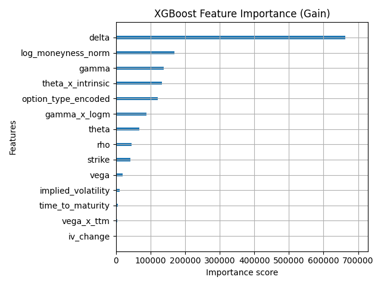
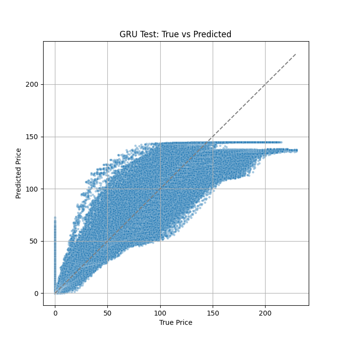

# Deep Learning for US Options Pricing

## Table of Contents

1. [Project Description](#project-description)
2. [Motivation & Background](#motivation--background)
3. [Data Description](#data-description)
    - [Feature Engineering](#feature-engineering)
4. [Repository Structure](#repository-structure)
5. [Modeling Approach](#modeling-approach)
    - [Baseline](#baseline)
    - [Advanced](#advanced)
    - [Tuning and Feature Scaling](#tuning-and-feature-scaling)
6. [Evaluation & Results](#evaluation--results)
    - [Models Compared](#models-compared)
    - [Performance Highlights](#performance-highlights)
    - [Key Plots](#key-plots)
    - [Analysis](#analysis)
7. [Limitations & Future Work](#limitations--future-work)
    - [Limitations](#limitations)
    - [Next Steps](#next-steps)
8. [How to Run](#how-to-run)
9. [References](#references)
10. [Contact / Contribution / License](#contact--contribution--license)

## Project Description

Inspired by techniques from recent academic literature and proprietary research, This repository explores, implements, and evaluates different Machine Learning models to emperically price American equity Options for the $AAPL stock. Comparisons are made between different Machine Learning models, namely:

1. XGBoost (Gradient-Boosted Trees) with Bayesian Hyperparameter Tuning
2. Gated Recurrent Unit (GRU)

## Motivation & Background
Market prices for options often deviate from theoretical values (determined by Black-Scholes, etc.) due to liquidity and market regime shifts.

We know that Machine Learning models can fit complex, nonlinear relationships between variables, and exploit additional features that are not necessarily captured by other methods of estimation.

This repo is based on recent research (See [[1]][ref1], [[2]][ref2]) and looks to bridge the gap between quant finance and modern ML.

## Data Description
For this project, I sourced recent historical options data from [Alpha Vantage](https://www.alphavantage.co/)'s Options Data API, with columns for expiration, strike, greeks, as well as integrating daily OHLC to try to capture market regime behaviour.

For this, I implemented a modular automated data ingestion pipeline using AWS S3 and Github Actions for scalibility and continuous integration during development.

In training, a time-based train/val/test split was used to avoid leakage; never shuffling entries across time in training, testing, or validation data.

### Feature Engineering
Here is the breakdown of features used in model training:
#### Features Used
1. 'strike'
2. 'option_type_encoded'
3. 'date'
4. 'implied_volatility'
5. 'delta'
6. 'gamma'
7. 'theta'
8. 'vega'
9. 'rho'
10. 'log_moneyness'
11. 'time_to_maturity'
12. 'log_moneyness_norm'
13. 'intrinsic_value_norm'

#### Greek product Features
I also feature-engineered several 'compound' features, calculated as simple products of greeks, namely:
1. 'delta_x_iv',
2. 'vega_x_ttm',
3. 'gamma_x_logm',
4. 'theta_x_intrinsic',

## Repository Structure
```
├───.github             # GitHub Actions/workflows for CI/CD automation
│   └───workflows       # CI/CD pipeline YAMLs
├───/dataIngest         # Automated data ingestion (config, helpers, schedulers, scripts)
│   ├───/config         # Ingestion configuration (API keys, settings)
│   ├───/helpers          # Utility functions for metadata, S3, etc.
│   ├───/logs           # Logs for ingestion processes
│   ├───/scheduler      # Scheduler scripts for timed data pulls
│   ├───/scripts        # Standalone scripts for fetching data
│   └───/src            # Core ingestion pipeline modules
├───/notebooks          # Jupyter notebooks for exploration and prototyping
├───/scripts            # Utility or run scripts (real-time, batch jobs, etc.)
└───/src                # Main source code for modeling and features
    ├───/features       # Feature engineering, indicator, and preprocessing code
    ├───/model          # XGBoost Model training, config, and evaluation
    └───/neural         # Neural network (GRU, attention) modules and experiments
```

## Modeling Approach
### Baseline
We used XGBoost regression for speed and feature importance as a baseline to compare the other models' performance.

### Advanced
Gated Recurrent Unit (GRU) neural networks with attention for sequence modeling, implementing with and without weighted loss functions to target fat tails and rare, high-value contracts.

### Tuning and Feature Scaling
We used Optuna for hyperparameter tuning. Feature was scaling handled using numpy and pandas.

## Evaluation & Results

### Models Compared
- **XGBoost** Regressor as a **Baseline**
- **GRU (Gated Recurrent Unit)** neural network with attention
- Both trained and evaluated on engineered theoretical feature set (Greeks, moneyness, TTM, etc.)

### Performance Highlights
1. The XGBoost model boasts a **low** RMSE and MAE, with sensible feature significance
1. At least **half** of all GRU model predictions are **within $9.36** of the true price

### Metrics

#### XGBoost Metrics
On a smaller test set segmented from the full data, the XGBoost model performed as follows:
- RMSE: 7.79099
- MAE: 2.11504
- MedAE: 0.23171
- R2: 0.97319

The test set used to evaluate the XGBoost model had lower values, explaining the lower RMSE.
#### GRU Metrics
On a full test split, the GRU performed as follows:
- RMSE: 12.31253
- MAE: 40.40102
- MedAE: 9.35814
- R2: 0.99193

### Key plots

#### XGBoost
 |  |
|:-----------------------------------------------:|:-----------------------------------------------------:|
| True vs Predicted Price                         | XGBoost Feature Importance                            |

#### GRU
|  |  |
|:--------------:|:--------------:|
|  True vs Predicted Price     | GRU QQ Plot of Residuals (against normal dist.)      |

### Analysis

#### Model Evaluation Table
Below is a table comparing the predictions of the GRU models, with the $\Delta$-values representing the difference between the model prediction and the true price.

| True Price ($) | XBoost ($) | GRU | $\Delta$ XGBoost (Abs) | $\Delta$ GRU (Abs) | $\Delta$ XGBoost (%) | $\Delta$ GRU (%) |
| ----------- | -------|-----|--------------------|----------------|------------------|---------------|
|            |              |                    
|             |              |
## Limitations & Future Work

### Limitations
1. Model underestimates ultra-expensive, illiquid contracts due to data imbalance
2. Only considers vanilla options; no spreads/multileg.

### Next Steps
- Implement LSTM (Long Short-Term Memory) model to compare
- Ensemble models
- More features
- Opportunities for transfer learning, real-time inference, and online retraining.
## How to Run
...
## References
See Papers:
1. [Pricing American Options using Machine Learning Algorithms](https://arxiv.org/abs/2409.03204)
2. [MLP, XGBoost, KAN, TDNN, and LSTM-GRU Hybrid RNN with Attention for SPX and NDX European Call Option Pricing](https://arxiv.org/abs/2409.06724)

[ref1]:https://arxiv.org/abs/2409.03204
[ref2]:https://arxiv.org/abs/2409.06724
## Contact / Contribution / License
...
